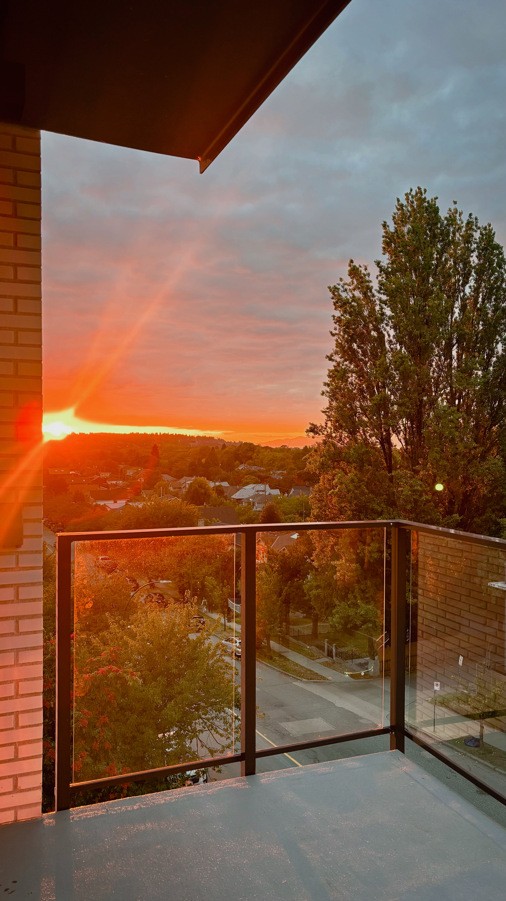

Starting the Master of Data Science at UBC has been an exciting experience so far. Orientation was a great opportunity to meet my classmates and get a sense of what the next few months would look like. Coming from Indonesia and starting this new chapter in Vancouver, it was exciting—and a little overwhelming—to suddenly be surrounded by people from different backgrounds and experiences.

The first weeks of classes have been fast-paced, with a lot to learn and even more to keep up with. What surprised me most was how quickly we moved from introductions to actually working with data, programming, and new concepts. I’m enjoying the challenge, especially seeing how different everyone's approaches can be when solving the same problem.

I’m still getting used to the pace and finding my routine, but I’m feeling excited about what’s ahead. There is definitely a lot to learn, but I’m looking forward to making the most of the MDS experience, both inside and outside the classroom.